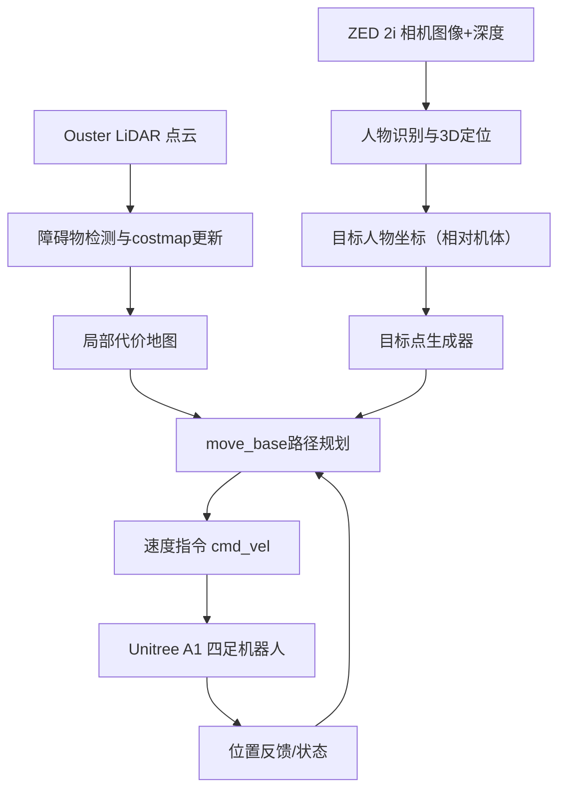

```mermaid
graph TD
    %% 感知数据流
    ZED[ZED 2i 相机图像+深度] --> ZED_PROC[人物识别与3D定位]
    LIDAR[Ouster LiDAR 点云] --> LIDAR_PROC[障碍物检测与costmap更新]

    %% 数据处理
    ZED_PROC --> TARGET[目标人物坐标（相对机体）]
    LIDAR_PROC --> COSTMAP[局部代价地图]

    %% 行为决策与控制
    TARGET --> GOAL_GEN[目标点生成器]
    COSTMAP --> MOVE_BASE
    GOAL_GEN --> MOVE_BASE[move_base路径规划]
    MOVE_BASE --> VELOCITY[速度指令 cmd_vel]

    %% 机器人执行
    VELOCITY --> A1[Unitree A1 四足机器人]

    %% 状态反馈
    A1 --> FEEDBACK[位置反馈/状态]
    FEEDBACK --> MOVE_BASE
```