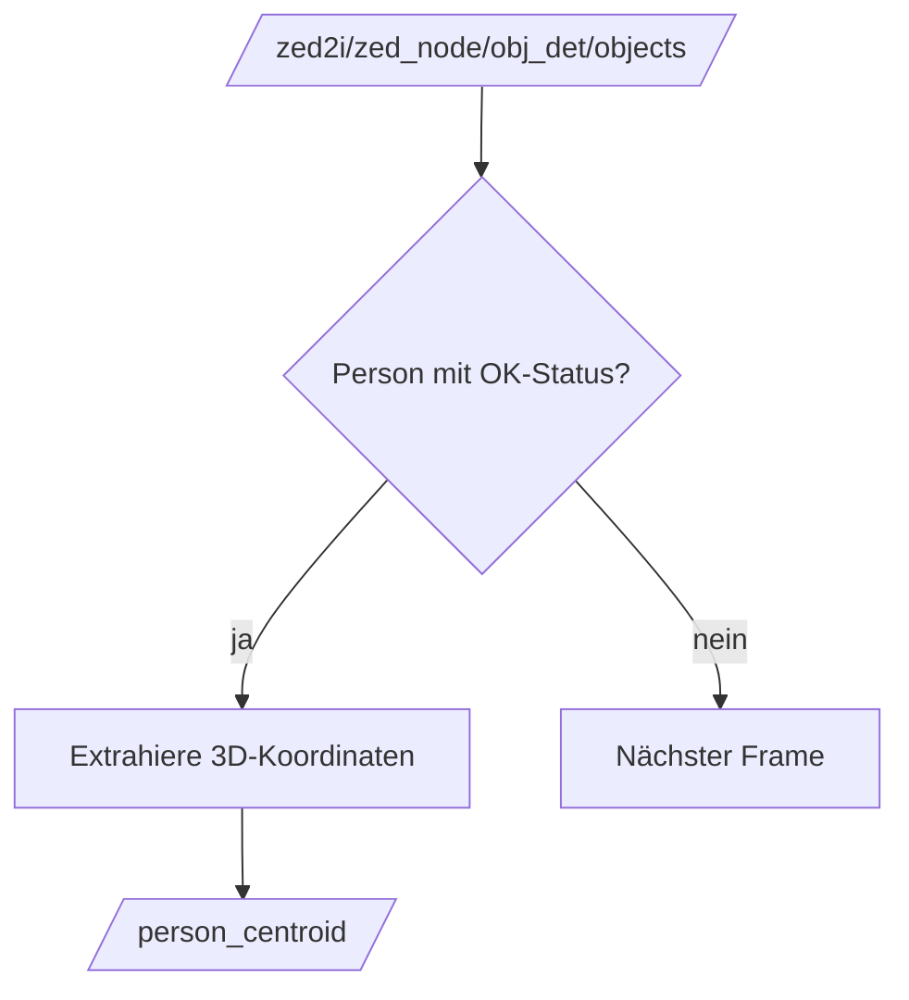

```mermaid
flowchart TD
    A[/zed2i/zed_node/obj_det/objects/] --> B{Person mit OK-Status?}
    B -- ja --> C[Extrahiere 3D-Koordinaten]
    C --> D[/person_centroid/]
    B -- nein --> E[Nächster Frame]

```