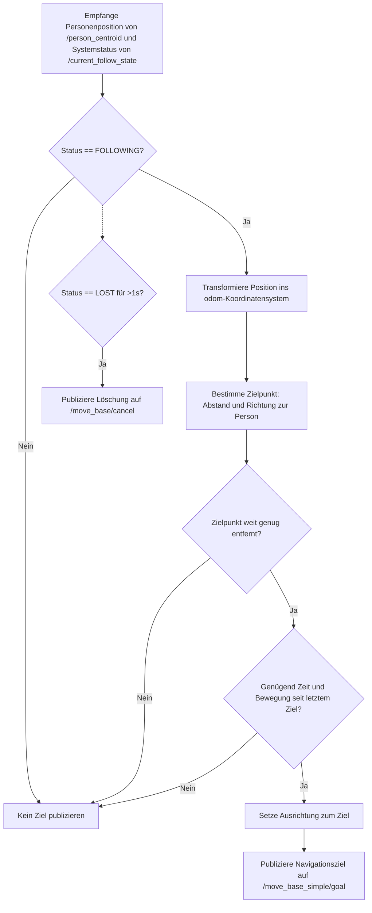

```mermaid
flowchart TD
    A[Empfange Personenposition von /person_centroid und Systemstatus von /current_follow_state] --> B{Status == FOLLOWING?}
    B -- Nein --> C[Kein Ziel publizieren]
    B -- Ja --> D[Transformiere Position ins odom-Koordinatensystem]
    D --> E[Bestimme Zielpunkt: Abstand und Richtung zur Person]
    E --> F{Zielpunkt weit genug entfernt?}
    F -- Nein --> C
    F -- Ja --> G{Genügend Zeit und Bewegung seit letztem Ziel?}
    G -- Nein --> C
    G -- Ja --> H[Setze Ausrichtung zum Ziel]
    H --> I[Publiziere Navigationsziel auf /move_base_simple/goal]
    B -.-> J{Status == LOST für >1s?}
    J -- Ja --> K[Publiziere Löschung auf /move_base/cancel]

```