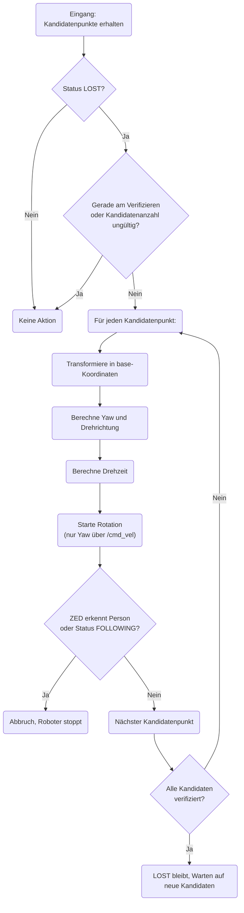

```mermaid
flowchart TD
    A("Eingang: Kandidatenpunkte erhalten") --> B{Status LOST?}
    B -- Nein --> X("Keine Aktion")
    B -- Ja --> C{Gerade am Verifizieren<br/>oder Kandidatenanzahl ungültig?}
    C -- Ja --> X
    C -- Nein --> D("Für jeden Kandidatenpunkt:")
    D --> E("Transformiere in base-Koordinaten")
    E --> F("Berechne Yaw und Drehrichtung")
    F --> G("Berechne Drehzeit")
    G --> H("Starte Rotation<br/>(nur Yaw über /cmd_vel)")
    H --> I{ZED erkennt Person<br/>oder Status FOLLOWING?}
    I -- Ja --> J("Abbruch, Roboter stoppt")
    I -- Nein --> K("Nächster Kandidatenpunkt")
    K --> L{Alle Kandidaten<br/>verifiziert?}
    L -- Nein --> D
    L -- Ja --> M("LOST bleibt, Warten auf neue Kandidaten")

```