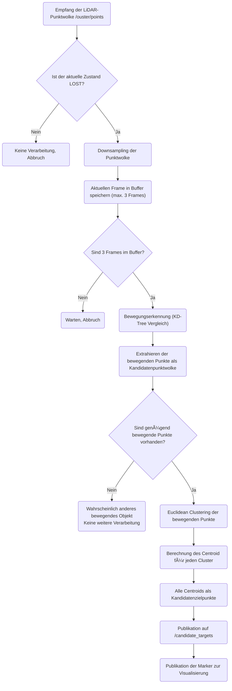

```mermaid
flowchart TD
    A("Empfang der LiDAR-Punktwolke /ouster/points") --> B{Ist der aktuelle Zustand LOST?}
    B -- Nein --> Z("Keine Verarbeitung, Abbruch")
    B -- Ja --> C("Downsampling der Punktwolke")
    C --> D("Aktuellen Frame in Buffer speichern (max. 3 Frames)")
    D --> E{Sind 3 Frames im Buffer?}
    E -- Nein --> Z1("Warten, Abbruch")
    E -- Ja --> F("Bewegungserkennung (KD-Tree Vergleich)")
    F --> G("Extrahieren der bewegenden Punkte als Kandidatenpunktwolke")
    G --> H{Sind genügend bewegende Punkte vorhanden?}
    H -- Nein --> Y("Wahrscheinlich anderes bewegendes Objekt<br/>Keine weitere Verarbeitung")
    H -- Ja --> I("Euclidean Clustering der bewegenden Punkte")
    I --> J("Berechnung des Centroid für jeden Cluster")
    J --> K("Alle Centroids als Kandidatenzielpunkte")
    K --> L("Publikation auf /candidate_targets")
    L --> M("Publikation der Marker zur Visualisierung")

```