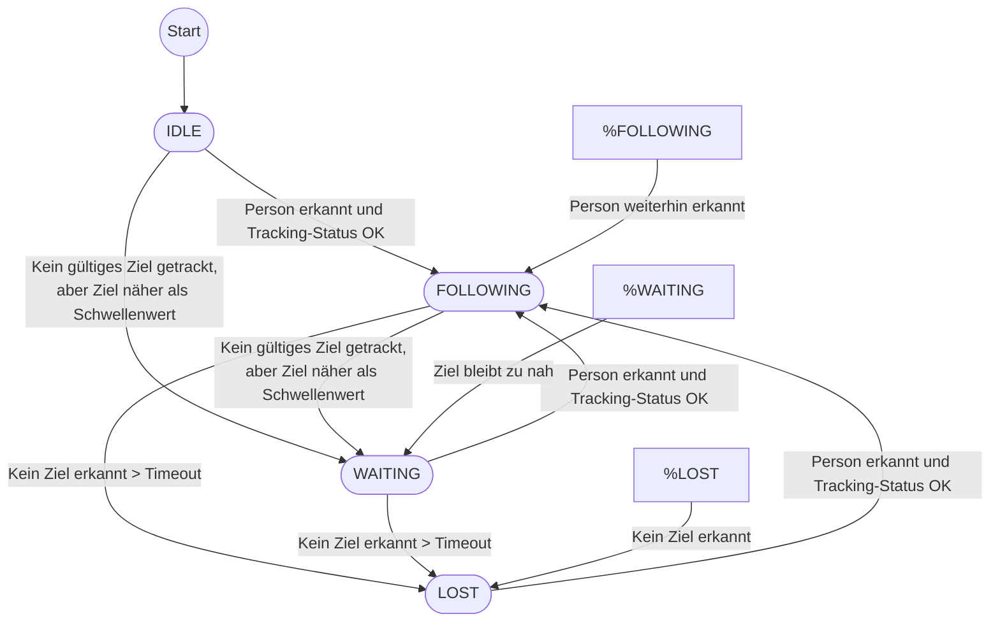

```mermaid
flowchart TD
    IDLE([IDLE])
    FOLLOWING([FOLLOWING])
    WAITING([WAITING])
    LOST([LOST])

    %% 系统启动，初始为IDLE
    START((Start)) --> IDLE

    %% 检测到有效目标
    IDLE -- "Person erkannt und Tracking-Status OK" --> FOLLOWING
    WAITING -- "Person erkannt und Tracking-Status OK" --> FOLLOWING
    LOST -- "Person erkannt und Tracking-Status OK" --> FOLLOWING

    %% 未能有效跟踪目标，但有目标很近
    IDLE -- "Kein gültiges Ziel getrackt,\naber Ziel näher als Schwellenwert" --> WAITING
    FOLLOWING -- "Kein gültiges Ziel getrackt,\naber Ziel näher als Schwellenwert" --> WAITING

    %% 目标丢失（长时间未检测到目标）
    FOLLOWING -- "Kein Ziel erkannt > Timeout" --> LOST
    WAITING -- "Kein Ziel erkannt > Timeout" --> LOST


    %% 保持当前状态的情况（可选，不画也行）
    %FOLLOWING -- "Person weiterhin erkannt" --> FOLLOWING
    %WAITING -- "Ziel bleibt zu nah" --> WAITING
    %LOST -- "Kein Ziel erkannt" --> LOST

```