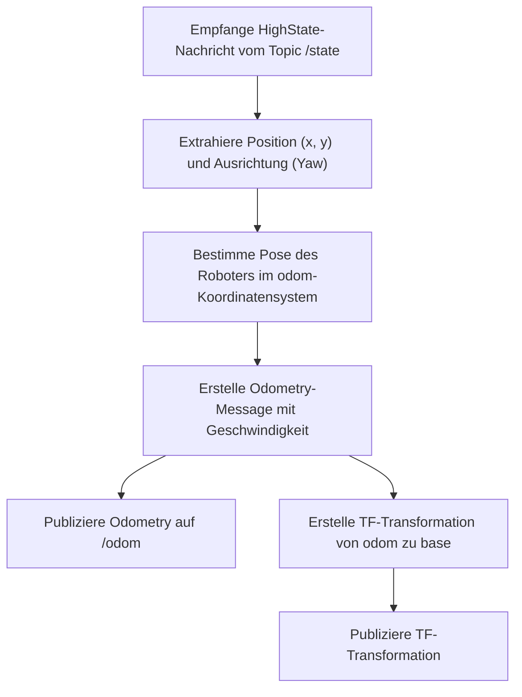

```mermaid
graph TD
    A["Empfange HighState-Nachricht vom Topic /state"]
    B["Extrahiere Position (x, y) und Ausrichtung (Yaw)"]
    C[Bestimme Pose des Roboters im odom-Koordinatensystem]
    D[Erstelle Odometry-Message mit Geschwindigkeit]
    E[Publiziere Odometry auf /odom]
    F[Erstelle TF-Transformation von odom zu base]
    G[Publiziere TF-Transformation]

    A --> B
    B --> C
    C --> D
    D --> E
    D --> F
    F --> G
```