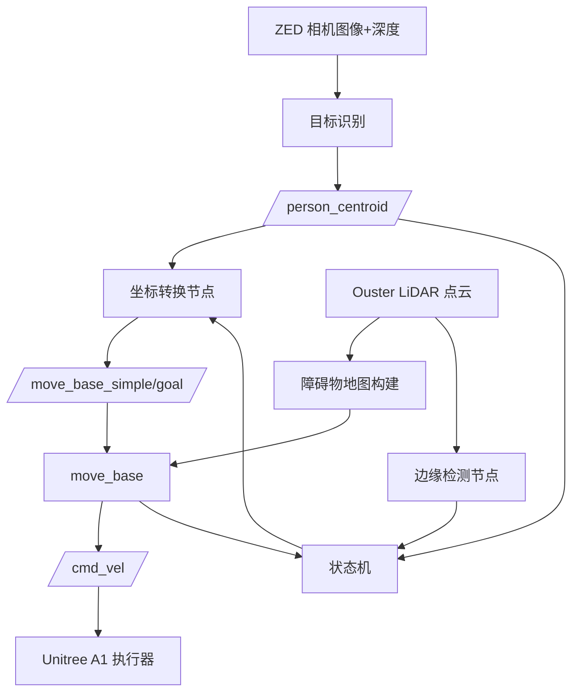

```mermaid
graph TD
    ZED[ZED 相机图像+深度] --> ZED_PROC[目标识别]
    ZED_PROC --> CENTROID[/person_centroid/]
    CENTROID --> TRANSFORM[坐标转换节点]
    TRANSFORM --> GOAL[/move_base_simple/goal/]

    LIDAR[Ouster LiDAR 点云] --> COSTMAP[障碍物地图构建]
    COSTMAP --> MOVEBASE[move_base]
    GOAL --> MOVEBASE
    MOVEBASE --> CMD[/cmd_vel/]
    CMD --> ROBOT[Unitree A1 执行器]

    MOVEBASE --> STATE_MACHINE[状态机]
    CENTROID --> STATE_MACHINE
    LIDAR --> EDGE_DETECTOR[边缘检测节点] --> STATE_MACHINE
    STATE_MACHINE --> TRANSFORM

```