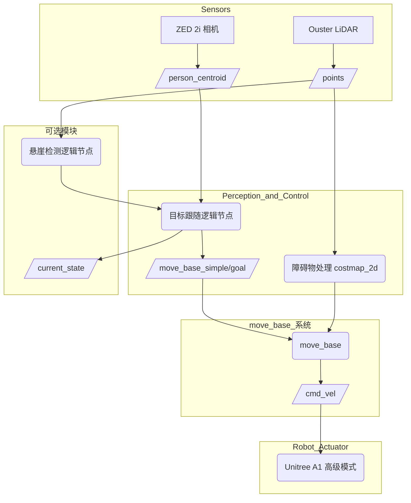

```mermaid
graph TD
    subgraph Sensors
        ZED[ZED 2i 相机] --> PERSON[/person_centroid/]
        LIDAR[Ouster LiDAR] --> POINTS[/points/]
    end

    subgraph Perception_and_Control
        PERSON --> FOLLOW_LOGIC(目标跟随逻辑节点)
        POINTS --> COSTMAP(障碍物处理 costmap_2d)
        FOLLOW_LOGIC --> GOAL[/move_base_simple/goal/]
    end

    subgraph move_base_系统
        GOAL --> MB(move_base)
        COSTMAP --> MB
        MB --> CMD[/cmd_vel/]
    end

    subgraph Robot_Actuator
        CMD --> A1(Unitree A1 高级模式)
    end

    subgraph 可选模块
        FOLLOW_LOGIC --> STATE[/current_state/]
        POINTS --> EDGE(悬崖检测逻辑节点)
        EDGE --> FOLLOW_LOGIC
    end

```