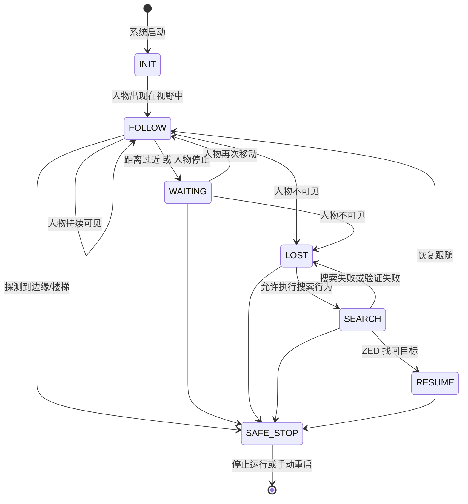

```mermaid
stateDiagram-v2
    [*] --> INIT : 系统启动
    INIT --> FOLLOW : 人物出现在视野中

    FOLLOW --> FOLLOW : 人物持续可见
    FOLLOW --> WAITING : 距离过近 或 人物停止
    FOLLOW --> LOST : 人物不可见

    WAITING --> FOLLOW : 人物再次移动
    WAITING --> LOST : 人物不可见

    LOST --> SEARCH : 允许执行搜索行为
    SEARCH --> RESUME : ZED 找回目标
    SEARCH --> LOST : 搜索失败或验证失败

    RESUME --> FOLLOW : 恢复跟随

    FOLLOW --> SAFE_STOP : 探测到边缘/楼梯
    WAITING --> SAFE_STOP
    LOST --> SAFE_STOP
    SEARCH --> SAFE_STOP
    RESUME --> SAFE_STOP

    SAFE_STOP --> [*] : 停止运行或手动重启

```